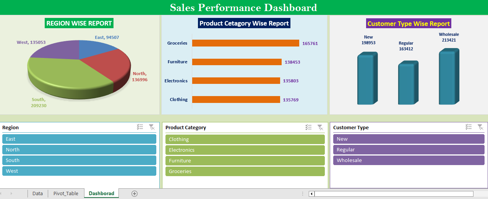

# 📊 Retail Store Sales Dashboard

## Description:

A dynamic **Sales Dashboard** designed to visualize and analyze business performance metrics such as revenue trends, top-performing products, regional sales distribution, and customer insights.  
This project helps decision-makers identify key growth areas and monitor KPIs in real-time.

---

## Project Overview:

The **Sales Dashboard** provides an interactive platform to:
- Track total sales, profit, and quantity over time.
- Identify the **highest sales month** and **top-performing products**.
- Analyze **regional and category-wise performance**.
- Monitor **customer and salesperson contributions**.
- Support data-driven decision-making using visual insights.

---

## Tools & Technologies:

**Microsoft Excel:** Data Cleaning, Preprocessing, Data Transformation, Modeling, Calculated Measures, KPIs, Dashboard Design, and Data Visualization. 

---

## Key Features:

✅ Interactive visuals (cards, charts, slicers, and filters)  
✅ Dynamic KPIs for Sales, Profit, and Quantity  
